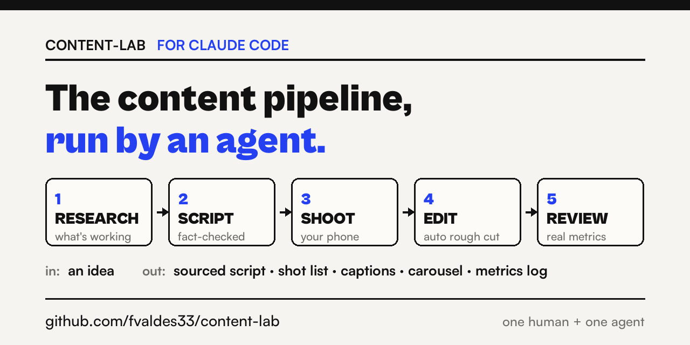

# content-lab



A content production system for one human and one AI agent. The agent does the evidence work — research, source ledgers, fact-check tables, script drafts, footage review, metrics logging. You keep the judgment — what's worth making, what sounds like you, and what gets killed.

Built and used in public by [Franco Valdes](https://www.instagram.com/itsfrancovaldes/). Honest disclosure up front: this system will not make your content go viral. Its author's biggest post while building it was a 20-minute meme, not the researched stuff. What the system does is make your content **accurate, consistent, and fast enough to keep shipping** — and it keeps you honest while you learn what actually works for you.

## What's inside

```
AGENTS.md                  Operating rules the agent follows (honesty, claims, privacy, economics)
.agents/skills/            The four skills (also symlinked into .claude/skills)
  onboard/                 Interview that builds YOUR profile, strategy, and boundaries
  produce-content-package/ Turns a selected idea into a fact-checked, recording-ready package
  research-feed-patterns/  Live-browses your feeds to study what's working (read-only)
  review-content-performance/ Turns published-post metrics into decisions
templates/post-package/    The seven files every serious package gets
examples/001-chatgpt-memory/ A real published package, unretouched — small numbers included
content/                   Your ideas, published packages, research notes, metrics
context/                   Your profile (created by /onboard)
```

## Quickstart

1. Install [Claude Code](https://claude.com/claude-code) (or any agent harness that reads `AGENTS.md`).
2. Use this template → clone your copy → open it in the harness.
3. Run **`/onboard`**. It interviews you (about 10 minutes) and writes `context/profile.md`, `content/STRATEGY.md`, and your personal boundaries into the rules. Nothing works right until this exists — the whole system keys off who you actually are and what you can honestly claim.
4. Pick an idea, run **`/produce-content-package`**, review every claim, rewrite the script until it sounds like you, shoot it, publish it yourself.
5. Report your numbers back with **`/review-content-performance`**. Judge nothing on one post.

Optional but recommended: `ffmpeg` + `whisper-cpp` (footage review: transcribe takes, pick keepers, assemble rough cuts), the Claude in Chrome extension (feed research), and the community **marketing-skills** plugin for the broader marketing surface (copywriting, launches, CRO) — where its generic advice conflicts with this repo's tested rules, this repo wins.

## The rules that make it work

- **Every factual claim maps to a source or gets cut.** The fact-check table is not optional. See the example package.
- **The agent never publishes, comments, or speaks as you.** It prepares; you press the buttons.
- **A killed post is the system working.** The agent packaged one of the author's posts perfectly; he watched the cut and killed it. That call doesn't automate.
- **Small numbers, stated honestly, are the brand.** Screenshots of real dashboards beat invented ones — especially in a feed full of invented ones.

## Study the example

`examples/001-chatgpt-memory/` is a real package exactly as published: production brief, research, 15-source ledger, script with its fact-check table, visual plan, repurposing, follow-up hypotheses, and results — including the modest real numbers. Read it before your first package; it teaches the standard faster than any doc.

Windows note: `.claude/skills` contains symlinks; enable symlinks in git (`git config core.symlinks true`) or copy the folders.
